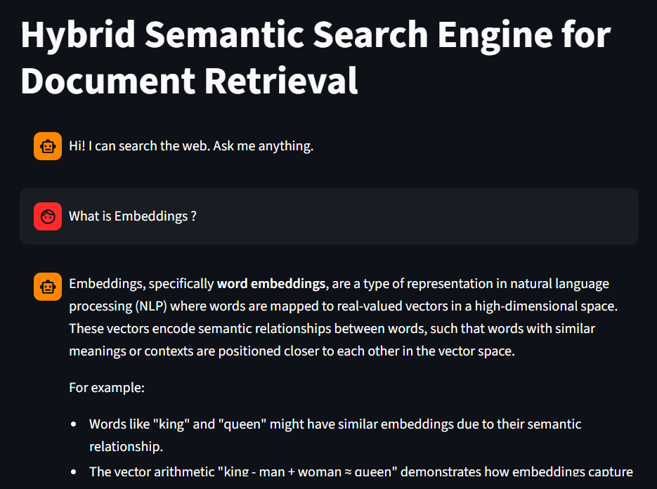
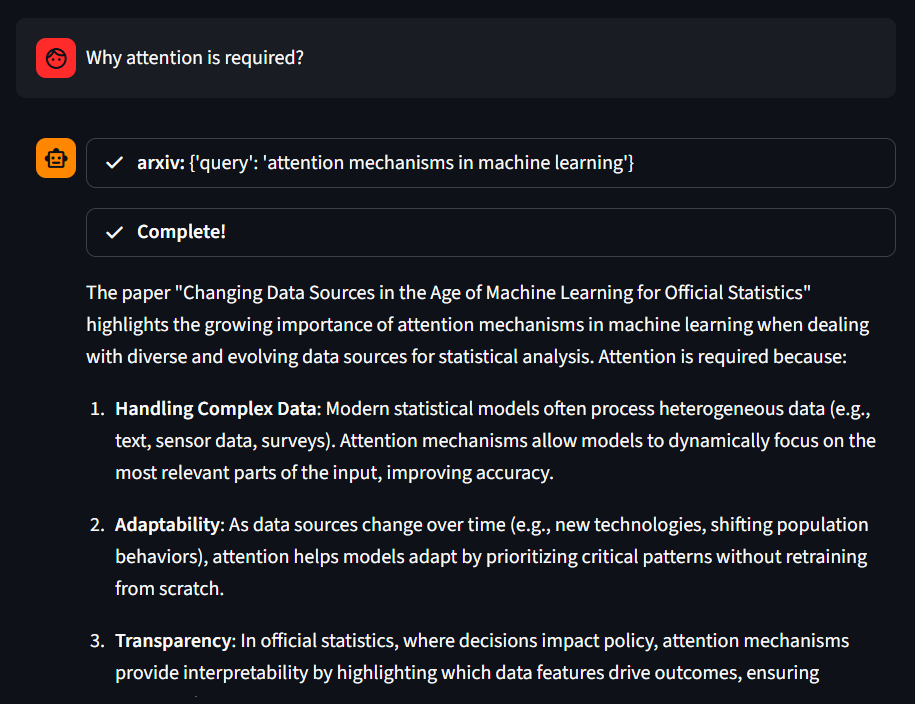

# **Hybrid Search Engine (Semantic + Keyword)**

## Overview
A search system that combines keyword-based and semantic search techniques to improve information retrieval accuracy.

## Problem Statement
Traditional keyword search fails to capture meaning, while semantic search may ignore exact matches. This project combines both approaches for better results.

## Architecture
User Query → Keyword Search + Embedding → Vector Search (FAISS) → Combined Results

## Tech Stack
- Python
- NLP Techniques
- FAISS (Vector Search)
- Embeddings

## Features
- Hybrid search (keyword + semantic)
- Improved search relevance
- Embedding-based similarity matching
- Efficient retrieval using vector database

## Example Queries
- "AI in healthcare"
- "Machine learning applications"
- "Deep learning vs machine learning"

## Live Demo
 [Live Demo](https://search-engine-gen-ai-swktuihviuuxmmx3wdifas.streamlit.app/)

 ## Screenshot
 
  
